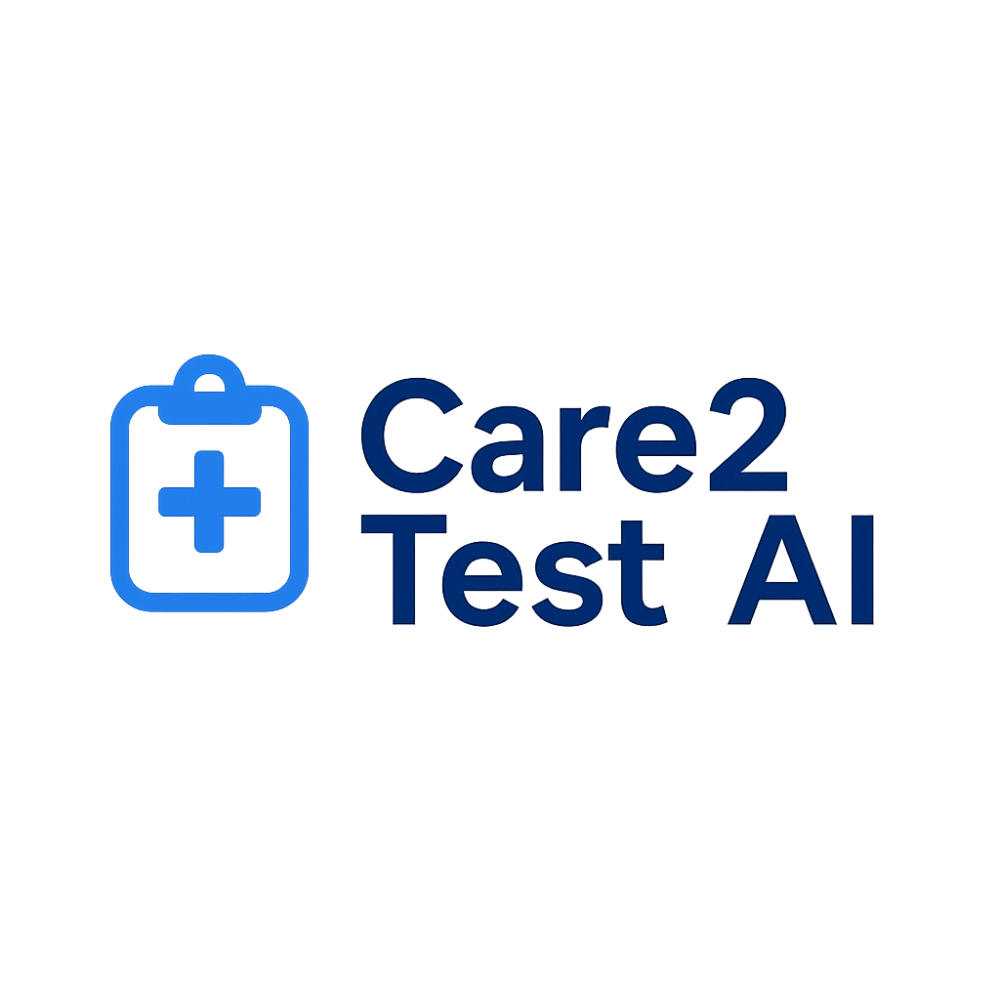
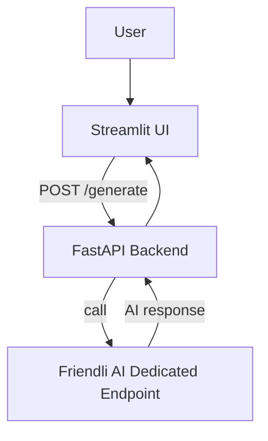

<p align="center">
  
</p>

# 🏥 Care2TestAI  

Care2TestAI is an **AI-powered test case generator** for healthcare software requirements.  
It converts plain-text requirements into **structured test cases** with AI assistance, ensuring compliance with standards like **HIPAA, GDPR, IEC 62304, and FDA**.  

---

## 🌐 Live Demo  

- **Frontend (Streamlit UI):** [care2testai-ui.streamlit.app](https://care2testai-ui.streamlit.app/)  
- **Backend (FastAPI on Render):** [care2testai.onrender.com](https://care2testai.onrender.com)  
- **GitHub Repo:** [siddth09/care2testai](https://github.com/siddth09/care2testai)  

---

## 🎥 Demo Video  

[](https://youtu.be/gSKWZw28__Y)  

_Click the image above to watch the demo on YouTube._  

---

## ⚙️ Tech Stack  

- **Frontend:** [Streamlit](https://streamlit.io/)  
- **Backend:** [FastAPI](https://fastapi.tiangolo.com/) + [Uvicorn](https://www.uvicorn.org/)  
- **AI Model Hosting:** [Friendli AI Dedicated Endpoints](https://friendli.ai) (Mixtral-8x7B-Instruct)  
- **Deployment:** [Streamlit Cloud](https://streamlit.io/cloud) (UI) + [Render](https://render.com/) (API)  
- **Libraries:** OpenAI Python SDK, Pydantic, Requests, Pandas, Streamlit  

---

## 🚀 Running Locally  

1. **Clone the repository**  
   ```bash
   git clone https://github.com/siddth09/care2testai.git
   cd care2testai
``

2. **Create a virtual environment & install dependencies**

   ```bash
   python -m venv venv
   source venv/bin/activate   # On macOS/Linux
   venv\Scripts\activate      # On Windows
   pip install -r requirements.txt
   ```

3. **Set Friendli API token**

   ```bash
   export FRIENDLI_TOKEN=your_api_key   # macOS/Linux
   set FRIENDLI_TOKEN=your_api_key      # Windows PowerShell
   ```

4. **Run the FastAPI backend**

   ```bash
   uvicorn main:app --reload --host 0.0.0.0 --port 8000
   ```

5. **Run the Streamlit frontend**

   ```bash
   streamlit run app.py
   ```

---

## 🛠 Features

* ✍️ Enter natural-language healthcare requirements
* 🤖 AI-powered test case generation (Friendli AI endpoint)
* 📊 Downloadable JSON outputs
* ⚡ FastAPI backend + Streamlit frontend
* 🔒 Compliance tags (HIPAA, GDPR, IEC 62304, FDA)

---

## 🏗 Architecture



---

## 📜 License

MIT License © 2025 [Siddharth](https://github.com/siddth09)
